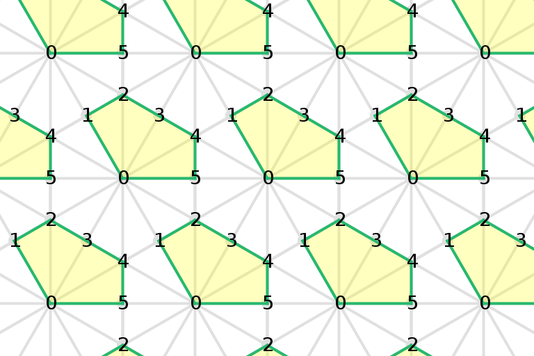
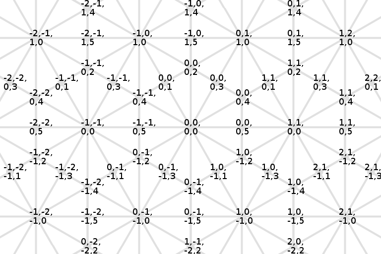
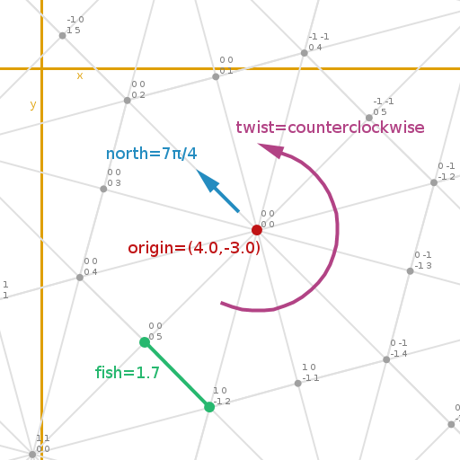
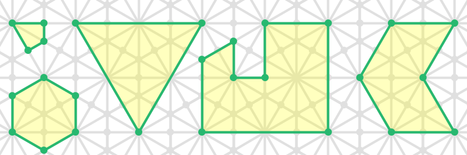
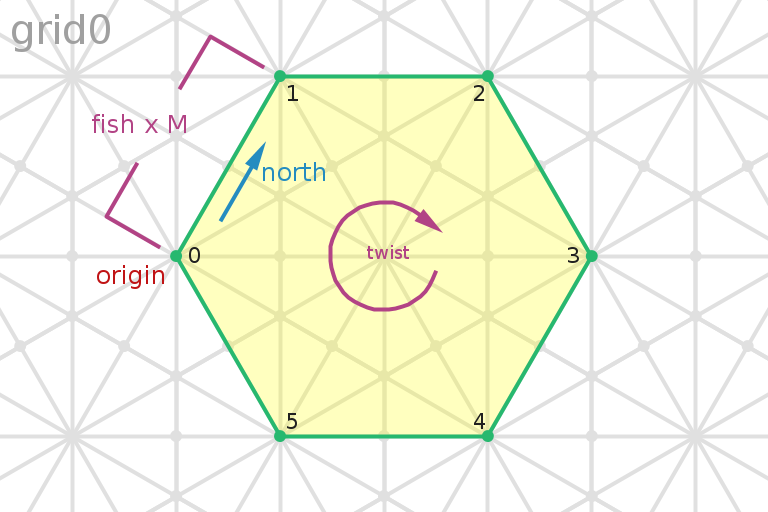
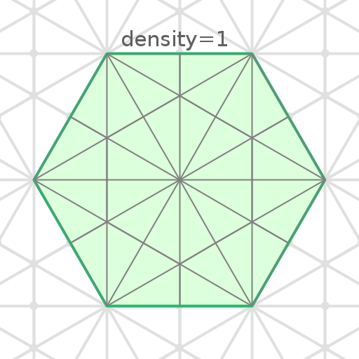
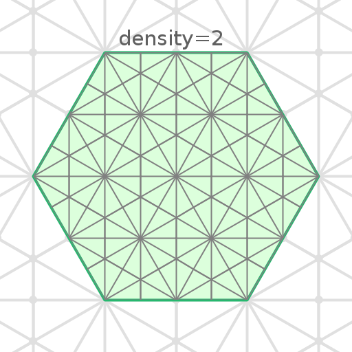
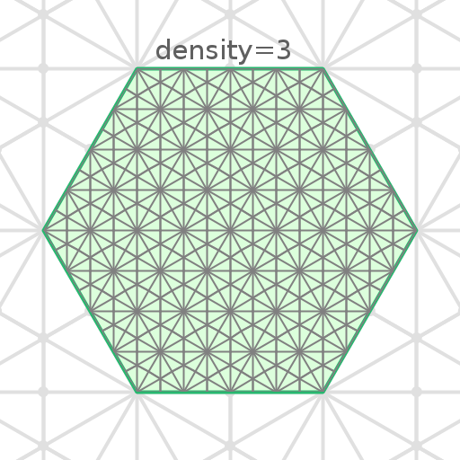
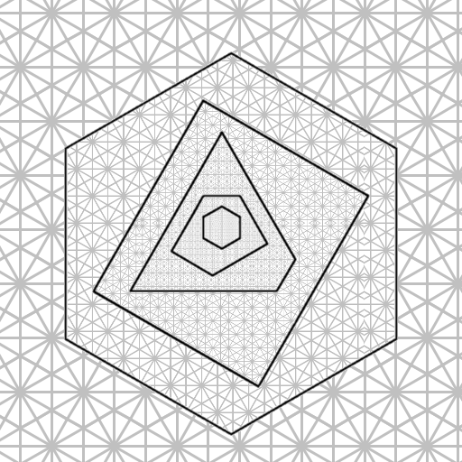
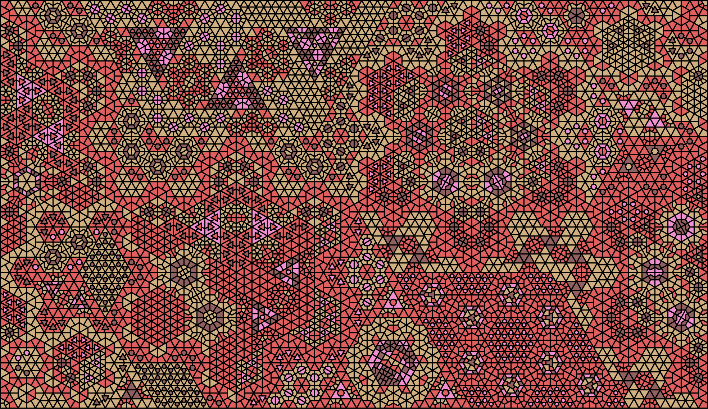

# A Kisrhombille Tessellation Based Geometry and a New Kind of Fractal

by John Greene john@fleen.org

---

## The Kisrhombille Tessellation

This is the kisrhombille tessellation.

It is a hexagon tessellation with each hexagon split into 12 triangles. 

| A hexagon | Split into 12 triangles   |
| --- | --- |
|  |  |

This is the triangle.

| Unit Triangle |   |
|---|---|
|   **F** length=1 **G** length=√3 **H** length=2 **P4** angle=π/2, connections=4 **P6** angle=π/3, connections=6 **P12** angle=π/6, connections=12  |  |

The intervals of **F**, **G** and **H** are referred to as **fish**, **goat** and **hawk**, respectively. 
**fish** is our unit interval. All the other intervals in this coordinate system derive from it.
**goat** = fish $\times$ √3
**hawk** = fish $\times$ 2

##KGrid : A Kisrhombille Tessellation Based Geometry Building System

**KGrid** is a geometry system (TODO game? formal system?...). Within it we build shapes and such. It has a method for addressing points and a rule governing how we build.

###Addressing Points

In KGrid we address the points where the corners of the triangles touch. That is to say, where the lines intersect. I.e. the black dots.

We address a point using four integers ([1](TODO)). 
**(ant,bat,cat,dog)**

The first three integers **(ant,bat,cat)** address a hexagon. 

 

The fourth integer **(dog)** addresses a point within a five-sided polygonal figure (the yellow things) based on that hexagon.

Put them together and that's our coordinate system. It's discrete.

###Axes, Directions and the Geometry Building Rule

In KGrid we have 6 axes and 12 directions. 

When we define shapes within KGrid we align their sides with the axes. 
**That's the building rule**. Just as if we were building the shapes out of **unit triangle** shaped tiles (see *The Kisrhombille Tessellation*, above).

##Object Classes

###KPoint
 
    class KPoint{
      ant
      bat
      cat
      dog
    }

3 examples of KPoint
 

A KPoint is a point in the KGrid.
**ant**, **bat**, **cat** and **dog** are integers.
Values for ant, bat and cat are in range \[minint,maxint\], though some combinations of values are invalid.
Value for dog is in range \[0,5\].

###KGrid

    class KGrid{
      origin
      north
      fish
      twist
    }
    
| 2 examples of KGrid | |
| --- | --- |
|  |  |
    
A KGrid is an instance of our coordinate system defined in terms of the plane. It shares its name with the geometry system that it implements. 
**origin** is a 2d point. It specifies the location of KPoint(0,0,0,0).
**north** is a floating point value describing a direction. It's the direction from KPoint(0,0,0,0) to KPoint(0,0,0,2).
**fish** is a floating point value. It is our unit interval. The shortest side of our unit triangle. 
**twist** is a value denoting chirality. Clockwise or counterclockwise. Probably boolean. It gives us the direction of east and west relative to north. It's also the direction that we go when traversing the perimenter of that hexagon-based figure that we use for **dog** (see above).

###KSeg

    KSeg{
      p0
      p1
    }

    
A KSeg is a line segment in a KGrid.
**p0** and **p1** are KPoints. Two points define a line segment. All line segments in our system align with the axes of the system, *viz* the points of a KSeg are always coaxial. See above for details on axes.

###KPolygon

    KPolygon{
      points
    }

    
AKPolygon is a polygon in a KGrid.
**points** is a list of 3..n KPoints. Each adjacent pair of points defines a KSeg. Thus, as is the case with KSegs, a KPolygon is aligned with the axes of our coordinate system. See above for details on axes.

## Nesting Geometry

Recall that we define a **KGrid** using 4 params : origin, north, fish and twist (see above).

We can derive these params from a **KPolygon**. We can derive **origin** from V0, **north** from dir(V0,V1), **fish** from dis(V0,V1) and **twist** from the chirality of the polygon's point sequence. ([2]())

For example.
Given **grid0**
Create a polygon (that hexagon there) in **grid0**. 
Then from that polygon derive the params for a new grid, **grid1**.

**grid1.origin** is the real point of **p0**.

**grid1.north** is the real direction from **p0** to **p1**.

**grid1.fish** is derived from the distance from **p0** to **p1** (dp0p1).  Get **M**, the distance from **p0** to **p1** in terms of **grid0.fish**.
Then **grid1.fish** = dp0p1 / M.

**grid1.twist** is derived from the chirality of the vertex process. Clockwise chirality means twist=true.

Thus we define a new grid, **grid1**.

(Note that our new grid is not actually constrained to the area of the polygon, I'm just illustrating it that way to make it clear.)

We can also use a 4th param, an integer, **density**. By dividing our new **fish** by **density** we can control the resolution of the new grid.([3]()) ([4]())

| 3 densities | | |
| --- | --- | --- |
|  |  |  |

And then, within that new grid, we can define another polygon, and so on.

Obviously this suggests that we could create some kind of infinite nesting structure, a variety of *vector fractal*. We could implement the play of geometry and geometry operators with some kind of *shape grammar*, manage symmetry and grouping somehow and get stuff like this

 

See the [Forsythia Fractal]() for more on that.

## FOOTNOTES

(1) Yes we could do it with 3 integers (2 for the hexagon and 1 for the figure) but right now we're doing it with 4. Going to 3 would mean rewriting a bunch of code.

(2) Details of fish derivation. We derive fish by getting the length of (v0,v1) in terms of fish (by adding up the segs) then divide the real distance from v0 to v1 by that to get fish.

(3) For density control we divide fish by the density param.

(4) We are exploiting a special property of the Kisrhombille Tessellation here. The property of the same shape being describable at an infinite range of tessellation resolutions. This property is shared by square and triangle tessellations but not by hexagon tessellations.

